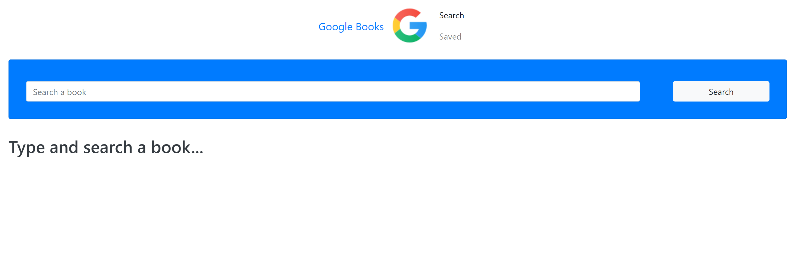
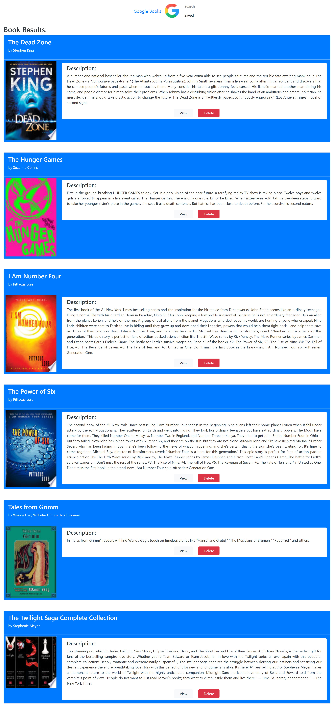

# Google-Books

## Description
This is web-app is a new React-based Google Books Search. It is required to create in React components, work with helper/util functions, and utilize React lifecycle methods to query and display books based on user searches. It uses Node, Express and MongoDB so that users can save books to review or purchase later.
Searching books are via [Google Books API](https://developers.google.com/books/docs/overview#books_api_v1)

## Deployment

Web app lived deployed @ https://aj-google-books.herokuapp.com/

## Create React

This project was bootstrapped with [Create React App](https://github.com/facebook/create-react-app).

## Screenshots

Welcome to Google-Books!

Search results.

Save books in saved page.

## Acknowledgements

- Mr. John
- Mr. Luis
- Oliver Shih
- William Lucht
